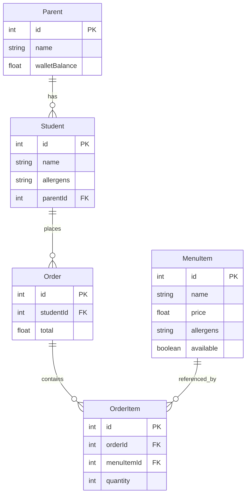

# Canteen Order System

# Task 1

a test

## Tech
* **Backend:** NestJS, TypeORM, SQLite (in Memory)
* **Frontend:** ReactJS(Vite), Axios

## Project Architecture

### Backend
Built with a modular architecture
*   **Common:** Shared logic
    * `Errors`
    * `Filers`
    * `Utils`

*   **Modules:** 
    *   `menu-item`: menu items in canteen.
    *   `order`: order placed.
    *   `order-item`: order item.
    *   `parent`: parent of student.
    *   `student`: student.
    *   `seed`: seed data. adds data on app start

#### ERD


### Transaction
have made Order Placement a Transaction using `@Transactional` of NestJS. this ensures atomic updates.

### If not transaction
If not Transaction, i would use mutex architecture. keep record of locks per parentId. so flow would be something like this

```
Request A (lock acquired)
  → process
  → release lock

Request B (waits)
  → process with updated balance
```
`NOTE: Although I do believe this would only work in one instance of server as locks are not shared. So we transaction is better.`

### Frontend
A react app with form

# Task 2
## Q: Some orders were created successfully, but the wallet balance was not deducted.

*   **What could cause this issue?**
    * non-atomic writes (order saved but wallet update failed)
    * DB transaction failed
    * race-condition: reqs read same balance and try to update multiple times
    * maybe that deduction of balance was a separate event(event driven), which failed
    * possible issue with idempotency: system saw the order already existed, so to avoid a duplicate, it just "re-created" the success response for the user. however, wallet balance deduction never happened for first order. only happened for second because assumption was made that if order was created, payment must have worked.
*   **How would you debug it?**
    * intercepet and log all incoming requests. would then log all ledger changes as well.
    Then, would select those orders from reqs whose ledger changes were not made.
    * in above logging system, a req id is issued on system hit. this can help find a trail.
    * check monitoring software like sentry for exceptions thrown/
    * clone suspencted data to local and run the order placement. find the bug
    * investing in load testing the order placement. this will remove edge cases like race conditions
*   **How would you prevent it in the future?**
    * single DB transaction. to ensure atomic updates
    * lock db row while udpateding
    * keep logging and monitoring software integration. all incoming requests are logged (request ids). exceptions are shown monitoring systems.
    * idempotency keys from frontend on order creation
    * system alarms: number of orders placed should always be equal to wallet deductions (or changes) made. this should be monitored. if theres a problem in this, alarm is raised.
    * testing: integration tests e2e testing can help reduce this issue before it arises. write tests for failure scenarios.


# task 3
for task 3, i have added reactJS + axios
## plan: 
* to make a form to place order.
* form should let user select student and menu-items
* this will then place order
* then show updated wallet amount of selected student's parent

### in production env
* student app
    * student would login via app
    * place order (can see menu items)
    * their parent's wallet amount is updated
    * the amount is shown as credit
    * students can see order history

* dashboard (manager)
    * visibility of inventory
    * visibility of students
